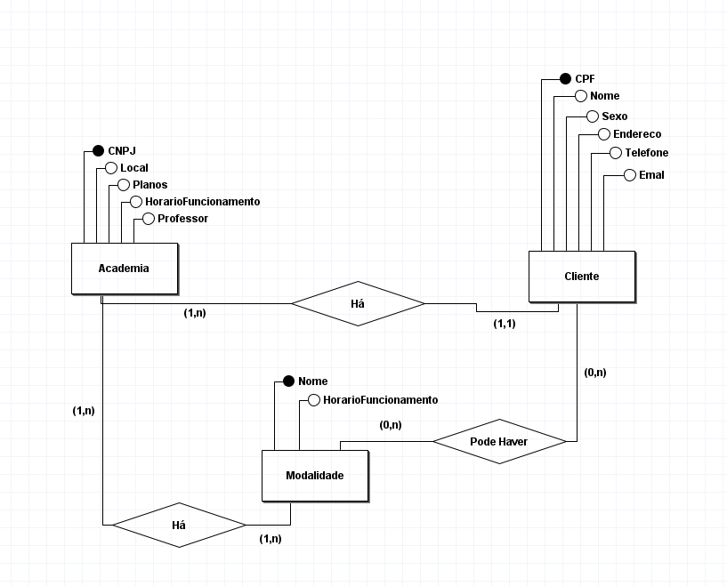
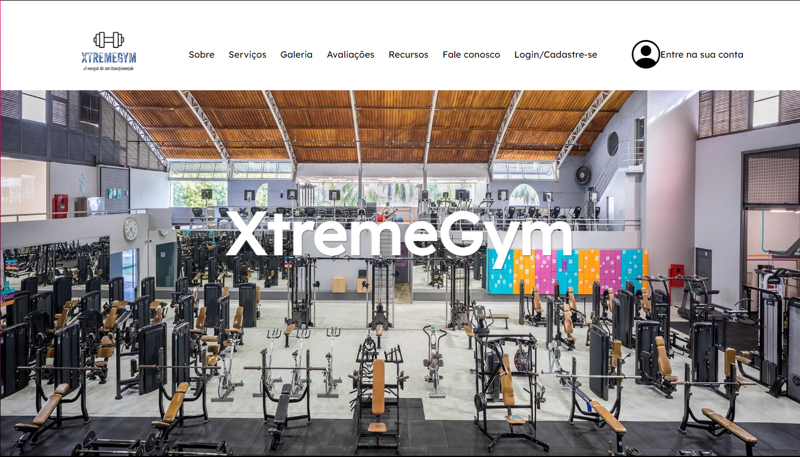
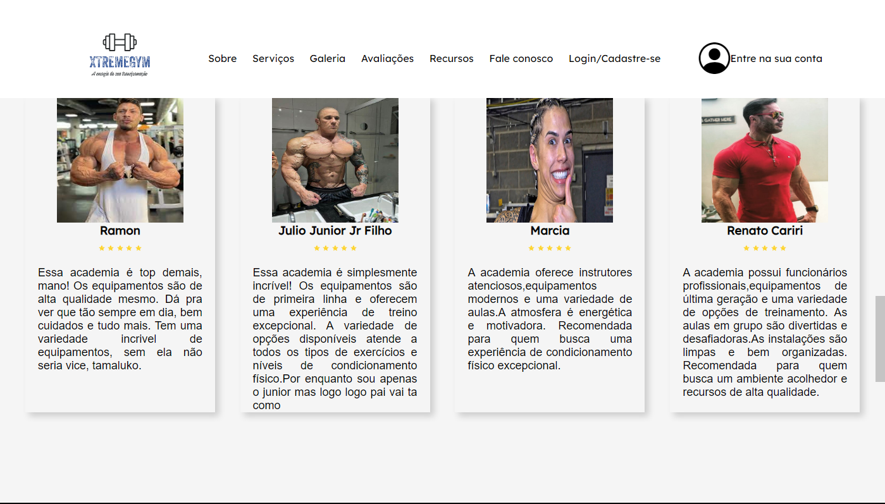
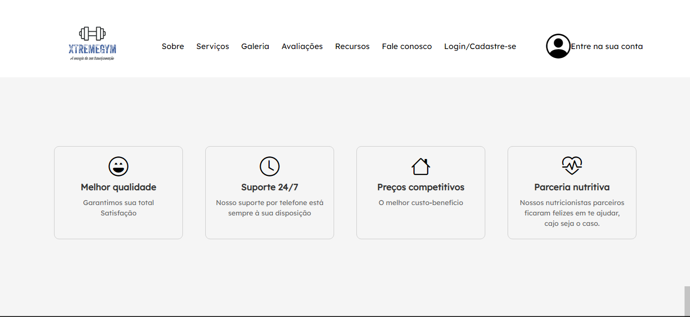
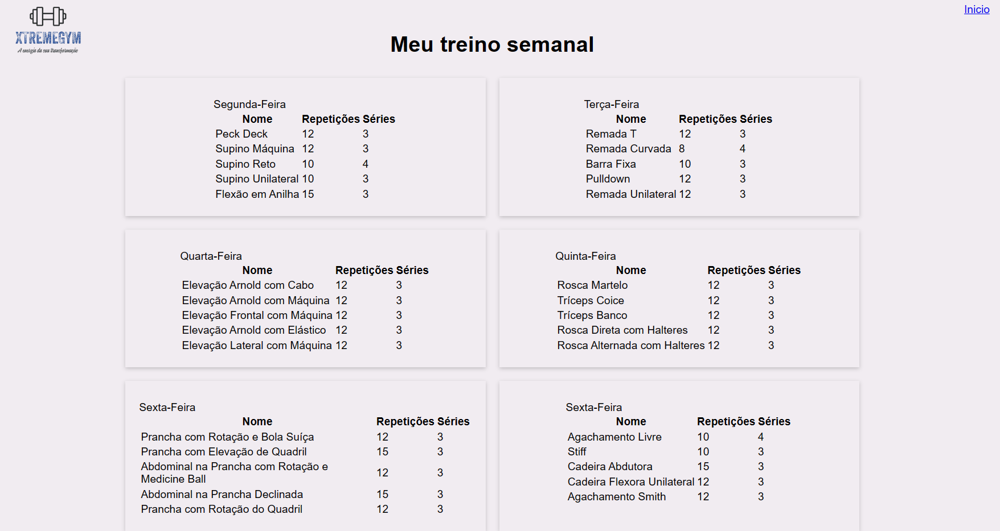
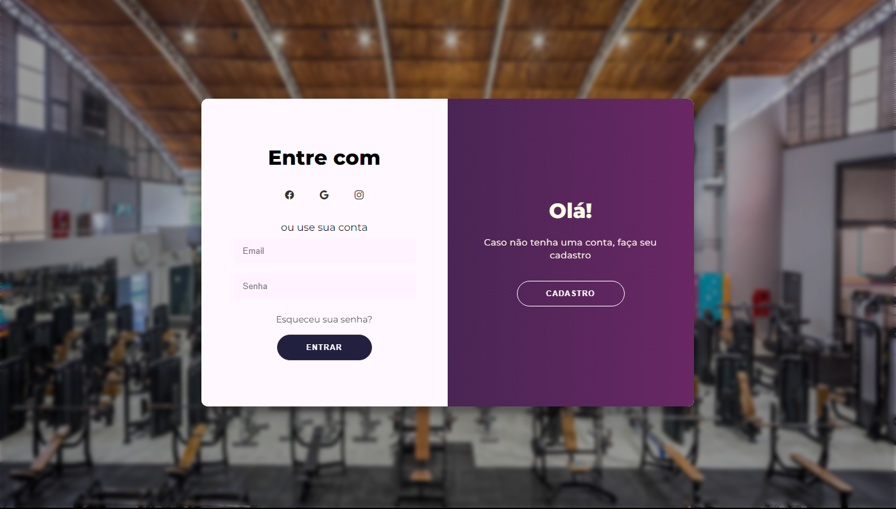
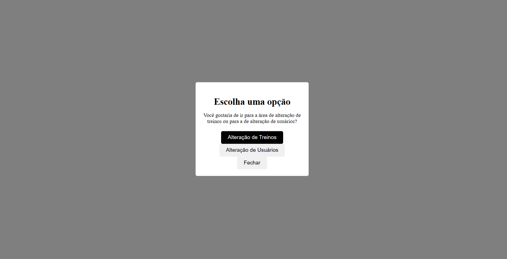
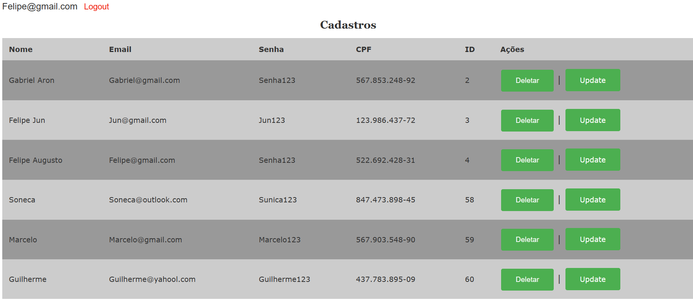
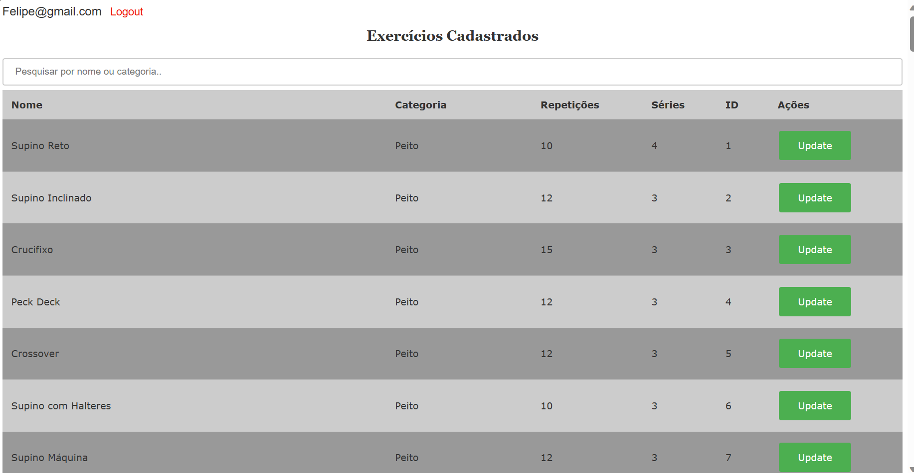

# ExtremeGym

Escopo Projeto Integrador

- Area Logada
- Area Não Logada
- Pagina "Quem somos"
- Nossos serviços
- Galeria
- Avaliações dos clientes
- Pagina "Seguir" com as redes sociais
- Fale Conosco
- Planos das nossas redes
- Nossas redes sociais
- Veja nossas unidades

  # MER
  

  # Protótipo do Site

  
  
  
  
  
  
  
  
  
  
  
  
  
	

# SQL
create table usuario(
	id int unique auto_increment primary key,
    nome varchar(255),
    CPF varchar(14) unique,
    email varchar(255) unique,
    senha varchar(255),
    adm boolean
);
Insert into USUARIO (NOME, CPF, EMAIL, SENHA, ADM) values ('Felipe Augusto', '522.692.428-31', 'Felipe@gmail.com', 'Senha123', TRUE);
Insert into USUARIO (NOME, CPF, EMAIL, SENHA, ADM) values ('Gabriel Aron', '567.853.248-92', 'Gabriel@gmail.com', 'Senha123', TRUE);
Insert into USUARIO (NOME, CPF, EMAIL, SENHA, ADM) values ('Felipe Jun', '123.986.437-72', 'Jun@gmail', 'Jun123', FALSE);
Insert into USUARIO (NOME, CPF, EMAIL, SENHA, ADM) values ('Soneca', '847.473.898-45', 'Soneca@outlook.com', 'Sunica123', FALSE);
Insert into USUARIO (NOME, CPF, EMAIL, SENHA, ADM) values ('Marcelo', '567.903.548-90', 'Marcelo@gmail.com', 'Marcelo123', FALSE);
Insert into USUARIO (NOME, CPF, EMAIL, SENHA, ADM) values ('Guilherme', '437.783.895-09', 'Guilherme@yahool.com', 'Guilherme123', FALSE);

create table exercicio(
	id int unique auto_increment primary key,
    categoria varchar(40),
    nome varchar(50),
    serie int,
    repeticao int
);
INSERT INTO exercicio (categoria, nome, serie, repeticao)
VALUES
    ('Peito', 'Supino Reto', 4, 10),
    ('Peito', 'Supino Inclinado', 3, 12),
    ('Peito', 'Crucifixo', 3, 15),
    ('Peito', 'Peck Deck', 3, 12),
    ('Peito', 'Crossover', 3, 12),
    ('Peito', 'Supino com Halteres', 3, 10),
    ('Peito', 'Supino Máquina', 3, 12),
    ('Peito', 'Supino com Barra', 4, 8),
    ('Peito', 'Flexão com Apoio', 3, 15),
    ('Peito', 'Flexão em Anilha', 3, 15),
    ('Peito', 'Crucifixo Inclinado', 3, 12),
    ('Peito', 'Supino Unilateral', 3, 10),
    ('Peito', 'Flexão com Deslocamento Lateral', 3, 15),
    ('Peito', 'Supino com Apoio', 3, 12),
    ('Peito', 'Flexão com Toque no Ombro', 3, 15),
    ('Costas', 'Barra Fixa', 3, 10),
    ('Costas', 'Remada Curvada', 4, 8),
    ('Costas', 'Levantamento Terra', 3, 12),
    ('Costas', 'Puxada Alta', 3, 12),
    ('Costas', 'Remada Neutra', 3, 15),
    ('Costas', 'Remada Cavalinho', 3, 12),
    ('Costas', 'Pulldown', 3, 12),
    ('Costas', 'Pull-Up', 3, 10),
    ('Costas', 'Remada Unilateral', 3, 12),
    ('Costas', 'Remada Baixa', 3, 15),
    ('Costas', 'Levantamento Terra Hexagonal', 3, 12),
    ('Costas', 'Remada com Halteres', 3, 12),
    ('Costas', 'Remada em Máquina', 3, 12),
    ('Costas', 'Remada T', 3, 12),
    ('Costas', 'Puxada Aberta', 3, 15),
    ('Ombro', 'Desenvolvimento com Barra', 4, 10),
    ('Ombro', 'Elevação Frontal', 3, 12),
    ('Ombro', 'Elevação Lateral', 3, 12),
    ('Ombro', 'Elevação Arnold', 3, 12),
    ('Ombro', 'Desenvolvimento com Halteres', 3, 12),
    ('Ombro', 'Elevação Frontal com Halteres', 3, 12),
    ('Ombro', 'Elevação Lateral com Halteres', 3, 12),
    ('Ombro', 'Elevação Arnold com Halteres', 3, 12),
    ('Ombro', 'Desenvolvimento Militar', 4, 8),
    ('Ombro', 'Elevação Frontal com Cabo', 3, 12),
    ('Ombro', 'Elevação Lateral com Cabo', 3, 12),
    ('Ombro', 'Elevação Arnold com Cabo', 3, 12),
    ('Ombro', 'Desenvolvimento com Máquina', 3, 12),
    ('Ombro', 'Elevação Frontal com Máquina', 3, 12),
    ('Ombro', 'Elevação Lateral com Máquina', 3, 12),
    ('Ombro', 'Elevação Arnold com Máquina', 3, 12),
    ('Ombro', 'Desenvolvimento com Elástico', 3, 12),
    ('Ombro', 'Elevação Frontal com Elástico', 3, 12),
    ('Ombro', 'Elevação Lateral com Elástico', 3, 12),
    ('Ombro', 'Elevação Arnold com Elástico', 3, 12),
    ('Biceps ou Triceps', 'Rosca Direta', 3, 12),
	('Biceps ou Triceps', 'Rosca Alternada', 3, 12),
	('Biceps ou Triceps', 'Rosca Martelo', 3, 12),
	('Biceps ou Triceps', 'Rosca Concentrada', 3, 12),
	('Biceps ou Triceps', 'Rosca Scott', 3, 12),
	('Biceps ou Triceps', 'Rosca 21', 3, 21),
	('Biceps ou Triceps', 'Tríceps Testa', 3, 12),
	('Biceps ou Triceps', 'Tríceps Frances', 3, 12),
	('Biceps ou Triceps', 'Tríceps Coice', 3, 12),
	('Biceps ou Triceps', 'Tríceps Corda', 3, 12),
	('Biceps ou Triceps', 'Tríceps Banco', 3, 12),
	('Biceps ou Triceps', 'Tríceps Mergulho', 3, 12),
	('Biceps ou Triceps', 'Tríceps Paralelas', 3, 12),
	('Biceps ou Triceps', 'Tríceps Supinado', 3, 12),
	('Biceps ou Triceps', 'Rosca Direta com Halteres', 3, 12),
	('Biceps ou Triceps', 'Rosca Alternada com Halteres', 3, 12),
	('Biceps ou Triceps', 'Rosca Martelo com Halteres', 3, 12),
	('Biceps ou Triceps', 'Rosca Concentrada com Halteres', 3, 12),
    ('Core', 'Prancha', 3, 30),
    ('Core', 'Prancha Lateral', 3, 30),
    ('Core', 'Prancha com Elevação de Pernas', 3, 15),
    ('Core', 'Prancha com Rotação', 3, 12),
    ('Core', 'Prancha com Braço Estendido', 3, 12),
    ('Core', 'Abdominal Tradicional', 3, 15),
    ('Core', 'Abdominal Crunch', 3, 15),
    ('Core', 'Abdominal com Elevação de Pernas', 3, 12),
    ('Core', 'Abdominal Invertido', 3, 15),
    ('Core', 'Abdominal com Bola', 3, 12),
    ('Core', 'Abdominal com Rotação', 3, 12),
    ('Core', 'Abdominal na Prancha Declinada', 3, 15),
    ('Core', 'Abdominal na Prancha com Bosu', 3, 12),
    ('Core', 'Abdominal na Prancha com Rotação', 3, 12),
    ('Core', 'Abdominal na Prancha com Rotação e Medicine Ball', 3, 12),
    ('Core', 'Prancha com Elevação de Quadril', 3, 15),
    ('Core', 'Prancha com Rotação do Quadril', 3, 12),
    ('Core', 'Prancha com Deslize', 3, 12),
    ('Core', 'Prancha com Bola Suíça', 3, 15),
    ('Core', 'Prancha com Rotação e Bola Suíça', 3, 12),
    ('Core', 'Prancha com Elevação de Pernas em Suspensão', 3, 12),
    ('Core', 'Abdominal com Corda', 3, 15),
    ('Core', 'Abdominal com Roda Abdominal', 3, 12),
    ('Core', 'Abdominal com Roda Abdominal em Pé', 3, 12),
    ('Core', 'Abdominal com Roda Abdominal e Bola Suíça', 3, 12),
    ('Core', 'Abdominal com Bicicleta', 3, 15),
    ('Core', 'Abdominal com Bicicleta Elevada', 3, 12),
    ('Core', 'Abdominal com Bicicleta e Medicine Ball', 3, 12),
    ('Core', 'Abdominal com Bicicleta em Suspensão', 3, 12),
    ('Core', 'Abdominal com Prancha', 3, 15),
    ('Core', 'Abdominal com Prancha Lateral', 3, 12),
    ('Perna', 'Agachamento Livre', 4, 10),
    ('Perna', 'Leg Press', 3, 12),
    ('Perna', 'Afundo', 3, 12),
    ('Perna', 'Cadeira Extensora', 3, 15),
    ('Perna', 'Cadeira Flexora', 3, 12),
    ('Perna', 'Agachamento Smith', 3, 12),
    ('Perna', 'Cadeira Adutora', 3, 12),
    ('Perna', 'Cadeira Abdutora', 3, 15),
    ('Perna', 'Stiff', 3, 10),
    ('Perna', 'Cadeira Flexora Unilateral', 3, 12),
    ('Perna', 'Panturrilha no Leg Press', 3, 15),
    ('Perna', 'Agachamento Hack', 3, 12),
    ('Perna', 'Elevação de Quadril', 3, 12),
    ('Perna', 'Cadeira Flexora em Pé', 3, 12),
    ('Perna', 'Cadeira Abdutora Unilateral', 3, 15);
