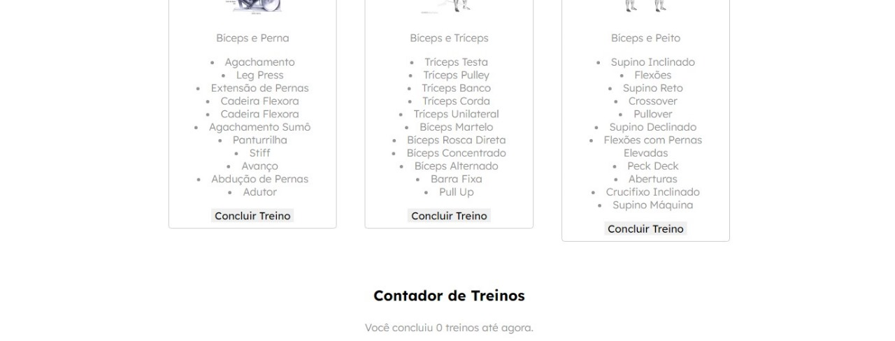

# ExtremeGym

Escopo Projeto Integrador

- Area Logada
- Area Não Logada
- Pagina "Quem somos"
- Nossos serviços
- Galeria
- Avaliações dos clientes
- Pagina "Seguir" com as redes sociais
- Fale Conosco
- Planos das nossas redes
- Nossas redes sociais
- Veja nossas unidades

  # MER
  

  # Protótipo do Site

  
  
  
  
  
  
  
  
  
  
  

# SQL
create table usuario(
	id int unique auto_increment primary key,
    nome varchar(255),
    CPF varchar(14),
    email varchar(255),
    senha varchar(255)
);

create table exercicio(
	id int unique auto_increment primary key,
    categoria varchar(40),
    nome varchar(50),
    serie int,
    repeticao int
);

create table exercicio(
	id int unique auto_increment primary key,
	nome Varchar(30),
    fkExercicios int,
		foreign key (fkExercicios) references treinos(id)
);

create table diaDaSemana(
	id int unique auto_increment primary key,
    nome Varchar(12),
    fkTreinos int,
		foreign key (fkTreinos) references treinos(id)
);

create table treino_exe (
	id int unique auto_increment primary key,
	fkTreinos int,
		foreign key (fkTreinos) references treinos(id),
    fkExercicios int,
		foreign key (fkExercicios) references exercicios(id)
);
